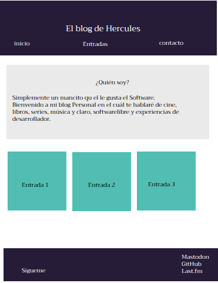
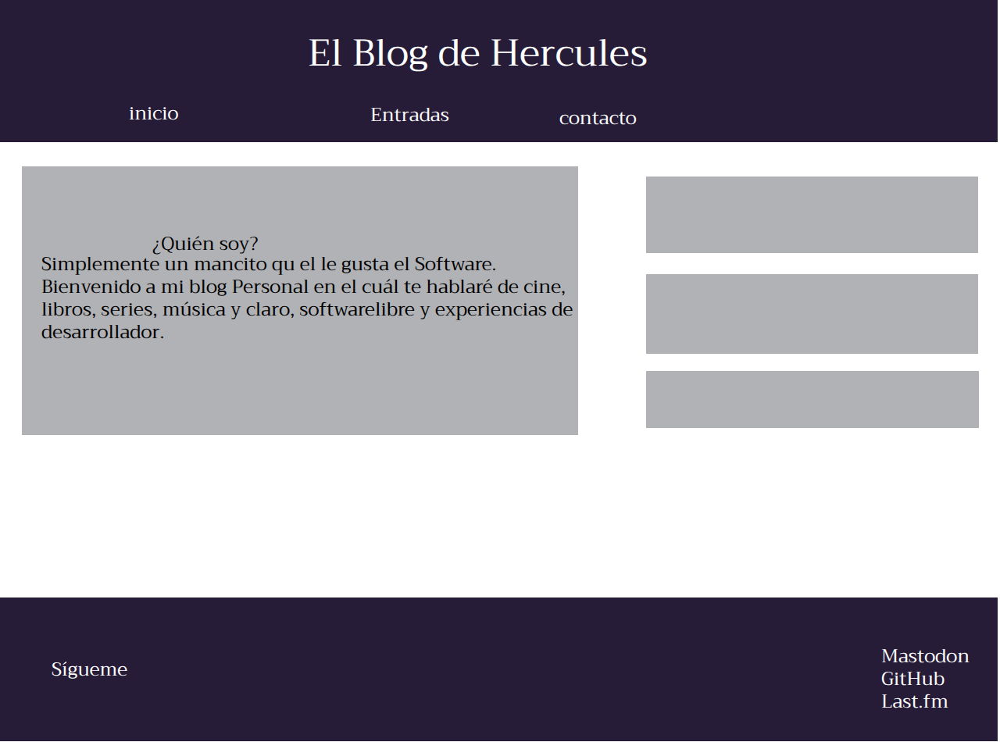
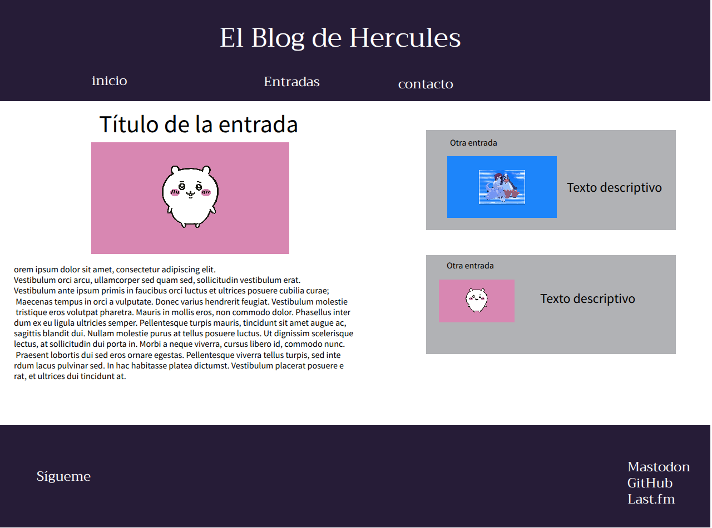
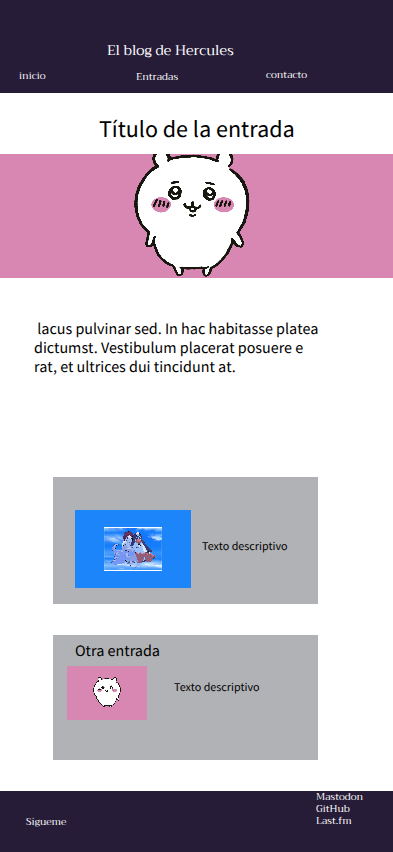

# Bienvenido al repositorio de mi blog

Ok, Para el momento estoy desarrollando una página sencillita para de esta manera ir ejercitando lo que voy aprendiendo en freecodecamp.

-------

## Diseño de la página

- **Entrada Principal**

- **Entrada Principal desde una vista móvil:**

- **Artículos**

- **Vista de los artículos desde el teléfono**

